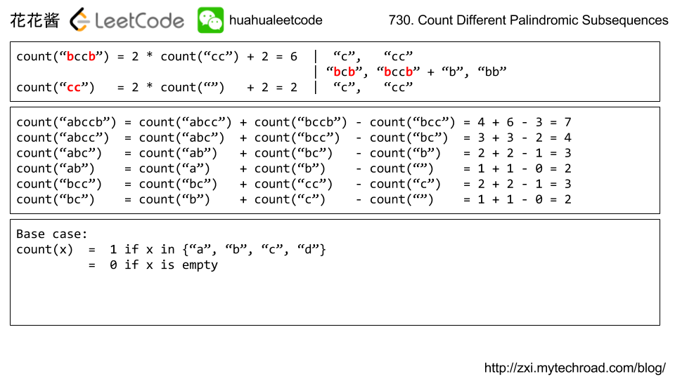
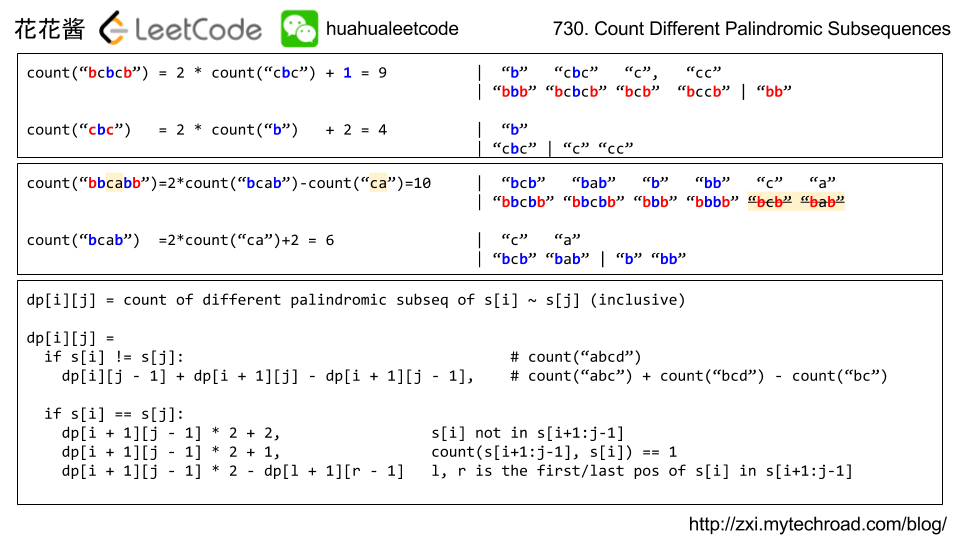

### Leetcode [730. 统计不同回文子序列](https://leetcode-cn.com/problems/count-different-palindromic-subsequences/)

```cpp
/*
	解法：题目中出现“删除”字眼一般比用区间dp。
	由小区间向大区间扩展。通过向小区间左边或者右边不断添加元素来产生新的回文子序列。
	其要遵循一定的规则。见下图：
*/
```





```cpp
const long MOD=1e9+7;
    int countPalindromicSubsequences(string S) {
        int n=S.size();
        int dp[n][n];
        memset(dp,0,sizeof dp);
        for(int i=0;i<n;i++)    dp[i][i]=1;
        for(int len=2;len<=n;len++)
        {
            for(int i=0;i+len-1<n;i++)
            {
                int j=len+i-1;
                if(S[i]!=S[j])
                    dp[i][j]=dp[i+1][j]+dp[i][j-1]-dp[i+1][j-1];
                else
                {
                    dp[i][j]=2*dp[i+1][j-1];
                    int l=i+1,r=j-1;
                    while(l<=r && S[l]!=S[i])   l++;
                    while(l<=r && S[r]!=S[j])   r--;
                    if(l>r) dp[i][j]+=2;
                    else if(l==r)  dp[i][j]+=1;
                    else dp[i][j]-=dp[l+1][r-1];
                }
                dp[i][j] =(dp[i][j]+MOD)%MOD;
            }
        }
        return dp[0][n-1];
    }
```


