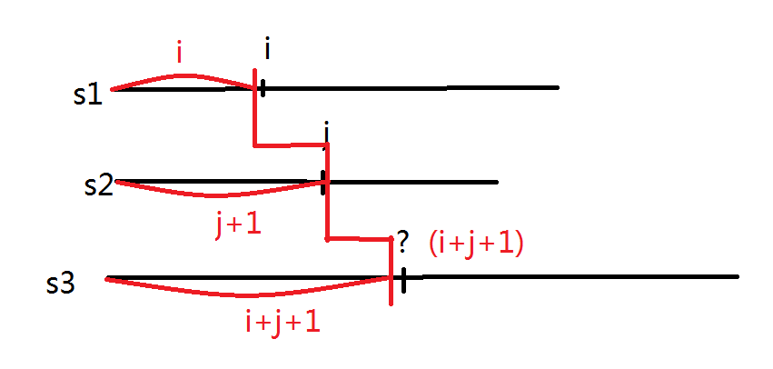

### leetcode [97. 交错字符串](https://leetcode-cn.com/problems/interleaving-string/)

```cpp
/*
解法：动态规划
	首先判断s1与s2的长度是否满足要求。
	然后利用动态规划
		dp[i][j]代表以s1[i-1],s2[j-1]结尾的字符串能否交错构成s3[i+j-1].
		则dp[i][j]==true if((s1[i-1]==s3[i+j-1] && dp[i-1][j]) || s2[j-1]==s3[i+j-1] && dp[i][j-1])
	注意s3的坐标是如何计算的见下图。
*/
```



```
bool isInterleave(string s1, string s2, string s3) {
        int n=s1.size(),m=s2.size(),t=s3.size();
        if(n+m!=t)  return false;
        bool dp[n+1][m+1];
        memset(dp,0,sizeof dp);
        dp[0][0]=true;
        for(int i=0;i<=n;i++)
        {
            for(int j=0;j<=m;j++)
            {
                if(i>=1 && s1[i-1]==s3[i+j-1] && dp[i-1][j])
                    dp[i][j]=dp[i-1][j];
                if(j>=1 && s2[j-1]==s3[i+j-1] && dp[i][j-1])
                    dp[i][j]=dp[i][j-1];
            }
        }
        return dp[n][m];
    }
```


