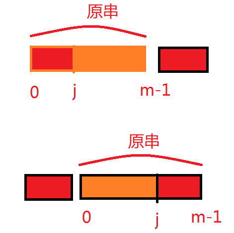

### leetcode [336. 回文对](https://leetcode-cn.com/problems/palindrome-pairs/)

```cpp
/*
	解法：哈希。
	一个很直观的想法是用暴力法。然而可能不过。
	考虑到原串可能包含回文的部分，因此先将原串翻转，并且存储其位置在哈希中。
	然后顺序遍历原串，截取其左半部分和右半部分。然后寻找剩余的部分在哈希中是否出现。如果出现了，就可以得到结果。
	见下图：
*/
```




```cpp
unordered_map<string_view,int> mp;
    vector<string> v;
    bool isPalindrome(string_view & str,int l,int r)
    {
        for(;l<=r;l++,r--)
        {
            if(str[l]!=str[r])  return false;
        }
        return true;
    }
    int findStr(string_view &str,int l,int r)
    {
        auto it=mp.find(str.substr(l,r-l+1));
        return it==mp.end()?-1:it->second;
    }
    vector<vector<int>> palindromePairs(vector<string>& words) {
        if(words.size()==0) return {};
        int n=words.size();
        for(auto & s:words)
        {
            v.push_back(s);
            reverse(v.back().begin(),v.back().end());
        }
        for(int i=0;i<n;i++)
        {
            mp[v[i]]=i;
        }
        vector<vector<int>> ans;
        for(int i=0;i<n;i++)
        {
            int m=words[i].size();
            if(m==0)    continue;
            string_view str(words[i]);
            for(int j=0;j<=m;j++)
            {
                if(isPalindrome(str,j,m-1))
                {
                    int idx=findStr(str,0,j-1);
                    if(idx!=-1 && idx!=i)
                    {
                        ans.push_back({i,idx});
                    }
                }

                if(j && isPalindrome(str,0,j-1))
                {
                    int idx=findStr(str,j,m-1);
                    if(idx!=-1 && idx!=i)
                    {
                        ans.push_back({idx,i});
                    }
                }
            }
        }
        return ans;
    }
```

